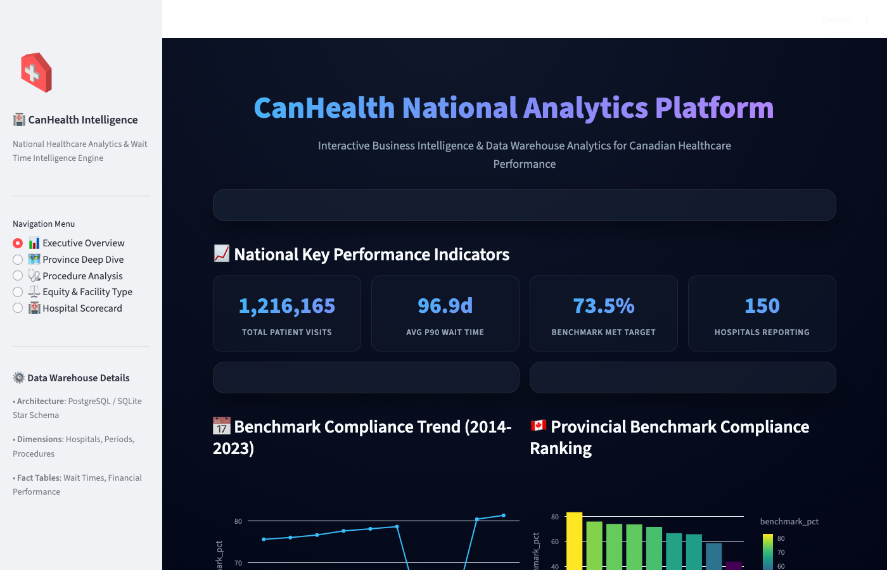
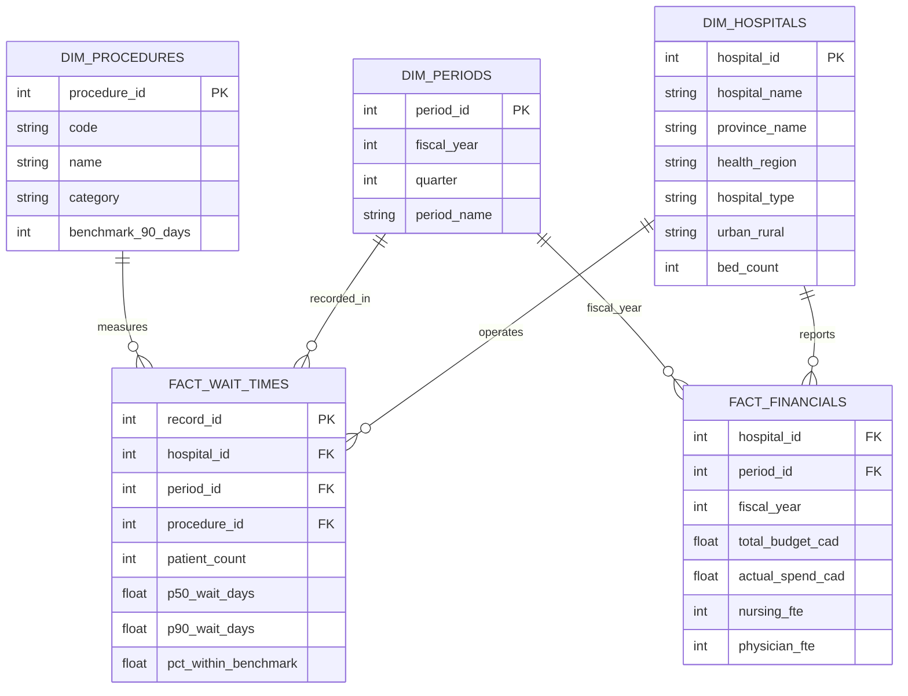

# 🏥 CanHealth Analytics — Healthcare Data Warehouse & Analytics Engine

[](https://www.postgresql.org/)
[](https://www.python.org/)
[](https://streamlit.io/)
[](https://en.wikipedia.org/wiki/Star_schema)
[](https://opensource.org/licenses/MIT)

An enterprise-grade **Healthcare Data Warehouse & Analytics Platform** built to analyze hospital operational efficiency, wait time benchmark compliance, financial sustainability, and healthcare access equity across Canadian health systems.

---

## 🖥️ Interactive Dashboard Preview



---

## 📌 Project Overview & Business Value

Healthcare leadership across Canada faces a complex dual challenge: **reducing procedure wait times** while **managing escalating hospital operating costs**. 

`canhealth-analytics` models a multi-subject **Star Schema Data Warehouse** that unifies clinical wait times (90th percentile wait in days, benchmark compliance percentages) with hospital financial statements (operating budget, actual spend, nursing & physician staffing FTEs).

---

## 🏗️ Data Warehouse Star Schema Architecture



---

## 💻 SQL Mastery & Analytics Engineering Highlights

The repository contains 8 production SQL scripts in `sql/` demonstrating advanced analytics engineering:

1. **`01_schema.sql`**: Data Definition Language (DDL) for dimensional tables, primary keys, foreign keys, and check constraints.
2. **`02_basic_exploration.sql`**: Data profiling, row counting, and data completeness auditing.
3. **`03_joins_aggregations.sql`**: Multi-fact table aggregations joining clinical wait times with financial metrics.
4. **`04_ctes_subqueries.sql`**: Multi-step Common Table Expressions (CTEs) for complex cohort analysis.
5. **`05_window_functions.sql`**: Advanced analytic windowing (`RANK()`, `DENSE_RANK()`, `LAG()`, `LEAD()`, `NTILE()`, running totals).
6. **`06_advanced_analytics.sql`**: Year-over-Year (YoY) growth calculations, hospital efficiency scoring, and outlier detection.
7. **`07_views_for_bi.sql`**: Materialized & Business Intelligence views optimized for Tableau, PowerBI, and Streamlit.
8. **`08_query_optimization.sql`**: B-Tree composite indexes, `EXPLAIN ANALYZE` execution plan tuning, and query optimization.

---

## 🖥️ Interactive Streamlit BI Analytics Dashboard

The platform includes a 5-page interactive Business Intelligence portal (`dashboard/streamlit_dashboard.py`):

1. **📊 Executive Overview**: National KPI metric cards, 10-year benchmark compliance trend lines, and provincial rank charts.
2. **🗺️ Province Deep Dive**: Interactive provincial comparison filtered by procedure category and fiscal year.
3. **🩺 Procedure Analysis**: Actual 90th percentile wait times vs National Benchmark targets per procedure type.
4. **⚖️ Equity Analysis**: Side-by-side wait time comparisons between Urban vs Rural healthcare facilities.
5. **🏥 Hospital Scorecard**: Searchable operational performance table showing bed capacity, patient volume, and wait times.

---

## 🚀 Quick Start & Running Locally

### 1. Clone the Repository
```bash
git clone https://github.com/Muttakim63/canhealth-analytics.git
cd canhealth-analytics
```

### 2. Set Up Virtual Environment & Dependencies
```bash
python3 -m venv venv
source venv/bin/activate
pip install -r requirements.txt
```

### 3. Generate Local Database (SQLite / PostgreSQL Compatible)
```bash
python setup_sqlite.py
```

### 4. Launch the Interactive BI Analytics Dashboard
```bash
streamlit run dashboard/streamlit_dashboard.py
```

---

## 📂 Repository Structure

```
canhealth-analytics/
├── assets/
│   └── dashboard_preview.png     # Interactive BI dashboard preview screenshot
├── dashboard/
│   ├── streamlit_dashboard.py    # 5-page Streamlit BI dashboard portal
│   └── README_dashboard.md       # BI connect instructions for Tableau/PowerBI
├── data/
│   ├── dim_hospitals.csv         # Hospital dimension table
│   ├── dim_periods.csv           # Fiscal period dimension table
│   ├── dim_procedures.csv        # Procedure benchmark dimension table
│   ├── fact_financials.csv       # Hospital financial performance fact table
│   └── fact_wait_times.csv       # Clinical wait times fact table
├── sql/
│   ├── 01_schema.sql             # DDL Star Schema definition
│   ├── 02_basic_exploration.sql  # Data auditing queries
│   ├── 03_joins_aggregations.sql # Multi-fact table aggregations
│   ├── 04_ctes_subqueries.sql    # Complex CTE queries
│   ├── 05_window_functions.sql   # Window functions (LAG, RANK, NTILE)
│   ├── 06_advanced_analytics.sql # YoY growth & hospital efficiency scoring
│   ├── 07_views_for_bi.sql       # Views for BI dashboards
│   └── 08_query_optimization.sql # B-Tree indexes & EXPLAIN ANALYZE tuning
├── src/
│   ├── eda.py                    # Exploratory Data Analysis python script
│   ├── generate_data.py          # Data warehouse synthesizer
│   └── load_postgres.py          # Postgres bulk loader script
├── setup_sqlite.py               # Self-contained database generator
├── requirements.txt              # Project dependencies
└── README.md                     # Documentation & architecture ERD
```

---

## 👨‍💻 Author

Developed by **Muttakim_A** ([@Muttakim63](https://github.com/Muttakim63))  
*Building Data Warehouses and Analytics Engineering Solutions for Healthcare.*
